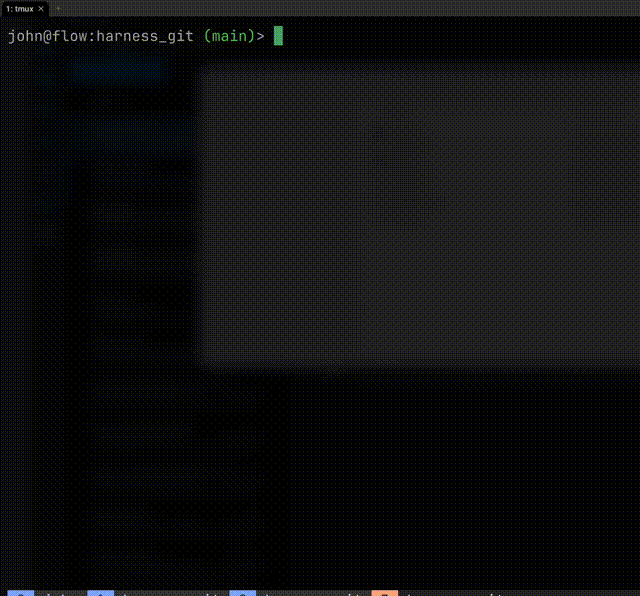

# simple_harness

Wiring harness editor and viewer in C. Based on [raylib](https://github.com/raysan5/raylib/).

Harness connectors and wiring are expressed in ASCII text files.

## Building

See (BUILDING.md)[BUILDING.md].

## Usage

1. `./simple_harness --make-template` generates a template file.
2. `./simple_harness ./template_harness.txt` launches the GUI viewer with the template file.

Assumes you know how to keep track of file edits and history yourself. The program does not ask to overwrite existing files or to save edits on quit.

## GUI shortcuts

- `control-n` - export a new template (overwrites `template_harness.txt` if it exists)
- `Control-s` - save edits
- `F12` - screenshot to a PNG file
- `q` - quit (does not ask to save edits; use this as a simple 'undo')
- `0` - reset zoom
- `+` - increase zoom
- `-` - decrease zoom
- `backspace` - reset pan
- `right mouse button` - drag to pan view
- `j`, `k`, `h` and `l` - pan view ala vim
- `left mouse button` - drag from one pin to another to add a wire
- `d` - with wire highlighted: delete wire
- `1` - with wire highlighted: cycle backward through wire colours
- `2` - with wire highlighted: cycle forward through wire colours
- `3` - with wire highlighted: decrease wire thickness
- `4` - with wire highlighted: increase wire thickness
- `n` - next harness
- `p` - next harness

## License

GPL v3
